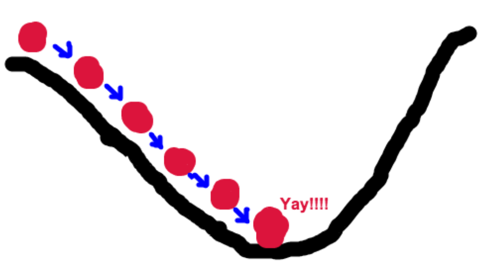

[TOC]
# 随机梯度下降法综述

## 引言

梯度下降法早在 1847 年由数学家`Cauchy`最先使用。它是最古老的一种解析方法，而其他解析方法大多承其衣钵，并构成最优化方法的基础。梯度下降法具有储存量小、结构简单、易于实现的优点，常作为机器学习领域内训练算法的核心算法，用来递归性地逼近最小偏差模型，如人工神经网络与`Logistic regression`，广泛应用于数据挖掘、模式识别等领域。梯度下降法存在多种变种，包括批量梯度下降、随机梯度下降等，批量梯度下降由于在每次计算中都需要考虑全部的样本信息，这对于大量样本的情况是很不理想的，而随机梯度下降在每次更新时都只会随机选取样本中的一个进行更新，这就大大减少了运算的复杂度。本文从一个简单的下山场景出发，提出随机梯度下降法的基本思想，之后从数学角度分析算法的原理，最后给出一个简单的算法实例。

## 梯度下降的场景假设

梯度下降法的基本思想可以简单类比成一个下山的过程。我们假设这样的场景：某个人被困在了一个很陡峭的山上，需要从山上下来（其实就是找到最低点的位置），而此时山上雾气很重，可视度很低。因此，下山的路径我们就无法直接确定了。这个时候，我们就可以采用梯度下降算法来帮助自己下山。以他当前的所处的位置为基准，寻找这个位置最陡峭的地方，然后朝着山的高度下降的地方走，同理，如果我们的目标是上山，也就是爬到山顶，那么此时应该是朝着最陡峭的方向往上走。然后每走一段距离，都反复采用同一个方法，最后就能成功的抵达山谷。



我们同时假设这座山最陡峭的地方是无法通过肉眼立马观察出来的，而是需要一个复杂的工具来测量，同时，这个人此时正好拥有测量出最陡峭方向的能力。所以，此人每走一段距离，都需要一段时间来测量所在位置最陡峭的方向，这是比较耗时的。那么为了在太阳下山之前到达山底，就要尽可能的减少测量方向的次数。这是一个两难的选择，**如果测量的频繁，可以保证下山的方向是绝对正确的，但又非常耗时，如果测量的过少，又有偏离轨道的风险**。所以需要找到一个合适的测量方向的频率，来确保下山的方向不错误，同时又不至于耗时太多！

## 梯度下降

梯度下降和下山的过程很类似。
首先，我们有一个**可微分的函数**。这个函数就代表着一座山。我们的目标就是**找到这个函数的最小值**，也就是山谷。根据之前的场景假设，最快的下山的方式就是找到当前位置最陡峭的方向（这里其实是有一点**贪心**（`Greedy`）的思想，通过局部最优解换取整体最优解），然后沿着此方向向下走，对应到函数中，就是找到给定点的梯度 ，然后朝着梯度相反的方向，就能让函数值下降的最快。
所以，我们重复利用这个方法，反复求取梯度，最后就能到达局部的最小值，这就类似于我们下山的过程。而求取梯度就确定了最陡峭的方向，也就是场景中测量方向的手段。那么为什么梯度的方向就是最陡峭的方向呢？

## 什么是梯度

梯度其实是多元函数微分的一般化。
举例来说：
$$
J(\theta) = 5 - (4\theta_1 + 7\theta_2 - 6\theta_3) 
$$
$$ 
\nabla J(\theta) = <\frac{\partial J}{\partial \theta_1}, \frac{\partial J}{\partial \theta_2}, \frac{\partial J}{\partial \theta_3}> = <1,-2,11>
$$

梯度其实就是对每个变量进行微分，然后用逗号隔开，并用`<>`表示，这说明，梯度其实是一个向量。

- 在单变量函数中，梯度就是函数的微分。
- 再多变量函数中，梯度是一个向量，而他的方向就是函数在定点上升最快的方向。

这也就说明了为什么我们需要千方百计的求取梯度！我们需要到达山底，就需要在每一步观测到此时最陡峭的地方，梯度就恰巧告诉了我们这个方向。梯度的方向是函数在给定点上升最快的方向，那么梯度的反方向就是函数在给定点下降最快的方向，这正是我们所需要的。所以我们只要沿着梯度的方向一直走，就能走到局部的最低点！

## 梯度下降的数学解释

我们现在从数学的角度给出梯度下降法的具体过程和思想。
基本公式：

$$
\theta^1 = \theta^0 - \alpha\nabla J(\theta)
$$

这个公式的意义是：假设我们当前所处的点为$\theta^0$，从这个点开始要走到最小值点。首先我们确定走的方向，也就是梯度的反方向（这也是问什么我们的公式中是**负号**），然后走一段距离为$\alpha$的步长，走完之后，我们就到达了$\theta^1$这个点。

- $\alpha$的含义是**步长或者学习率**。我们可以通过调整$\alpha$的值来控制每一次下降的距离，选择合理的$\alpha$对于梯度下降而言尤其重要。$\alpha$过大，会导致最后选择的路径不是最佳路径，从而无法到达最低点；$\alpha$太小，反而会因为多次测量计算造成算法的时间复杂度过高，耗时变长。


## 梯度下降法的简单应用

问题：求函数$f(x, y) = (x - 10) ^ 2 + (y - 10) ^ 2$的极小值。

解：函数的梯度可以得出：$$\nabla f(x, y) = (2(x - 10), 2(y - 10))$$

所以我们可以得到梯度下降的递推公式：
$$
(x^k, y^k) = (x ^{k - 1}, y^{k - 1}) - \alpha \nabla f(x ^ {k - 1}, y ^ {k - 1})
$$

我们假设$\alpha = 0.1$，初始化点为$(20, 20)$，那么梯度下降算法的`Python`代码如下：

```python
import matplotlib.pyplot as plt
import numpy as np
from mpl_toolkits.mplot3d import Axes3D

def fxy(x, y):
 return (x - 10) ** 2 + (y - 10) ** 2

def gradient_descent():
    times = 100 # 迭代次数
    alpha = 0.1 # 步长
    x = 20 # x的初始值
    y = 20 # y的初始值

    fig = Axes3D(plt.figure()) 
    xp = np.linspace(0, 20, 100)
    yp = np.linspace(0, 20, 100)
    xp, yp = np.meshgrid(xp, yp)
    zp = fxy(xp, yp)                
    fig.plot_surface(xp, yp, zp, rstride = 1, cstride = 1, cmap = plt.get_cmap('rainbow'))

 # 梯度下降
    for i in range(times):
        xb = x         
        yb = y        
        fb = fxy(x, y)  
        x = x - alpha * 2 * (x - 10)
        y = y - alpha * 2 * (y - 10)
        f = fxy(x, y)
        print("第%d次迭代：x=%f，y=%f，fxy=%f" % (i + 1, x, y, f))
        fig.plot([xb, x], [yb, y], [fb, f], 'ko', lw=2, ls='-')
    plt.show()

if __name__ == "__main__":
    gradient_descent()
```

迭代过程部分截图：


可视化结果如下：其中黑色部分既是我们的下降曲线。


## 总结

随机梯度下降算法是一种很常见的优化算法，几乎当前每一个先进的(`state-of-the-art`)机器学习库或者深度学习库都会包括梯度下降算法的不同变种实现。以梯度下降算法为基础，衍生出了繁多的变种优化算法，包括`Adagrad`-自适应梯度、`Adam`-自适应矩估计等。实际应用中，应该依据不同的问题场景和数据情况选用不同的梯度下降算法模型解决问题。